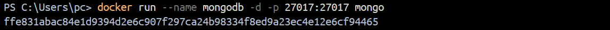
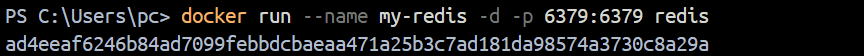
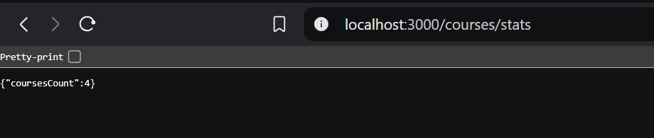

# Projet de fin de module NoSQL
## Course Management System

### Réalisé par Anouar Moudad

Ce projet est une application backend pour la gestion des cours, offrant des fonctionnalités de création, mise à jour, suppression et récupération de données.

## Comment lancer le projet

### Configurer Redis et MongoDB avec Docker

Pour configurer Redis et MongoDB, suivez les étapes ci-dessous :

1. **Télécharger les images Docker** :
   Téléchargez les images de Redis et MongoDB depuis le registre Docker.
   
   
    
   
2. **Démarrer les conteneurs** :
   Lancez les conteneurs Redis et MongoDB.

3. **Vérifier l'état des conteneurs** :
   Assurez-vous que les conteneurs fonctionnent correctement.
   

### Démarrer l'application

Pour démarrer l'application, utilisez la commande suivante :
```bash
npm start
```
   

### Fonctionnalités de l'application

- **Ajout de cours** :
  Ajoutez quelques cours à notre collection en utilisant mongosh.
  
- **Recherche de cours** :
  Recherchez des cours dans la base de données.
  
- **Statistiques des cours** :
  Consultez les statistiques des cours.
  